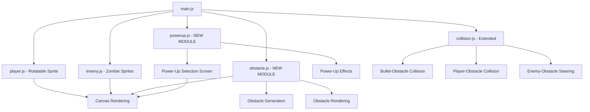
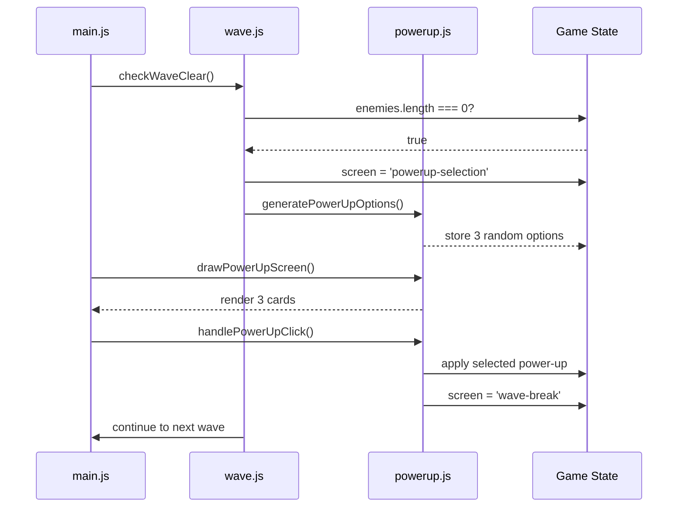
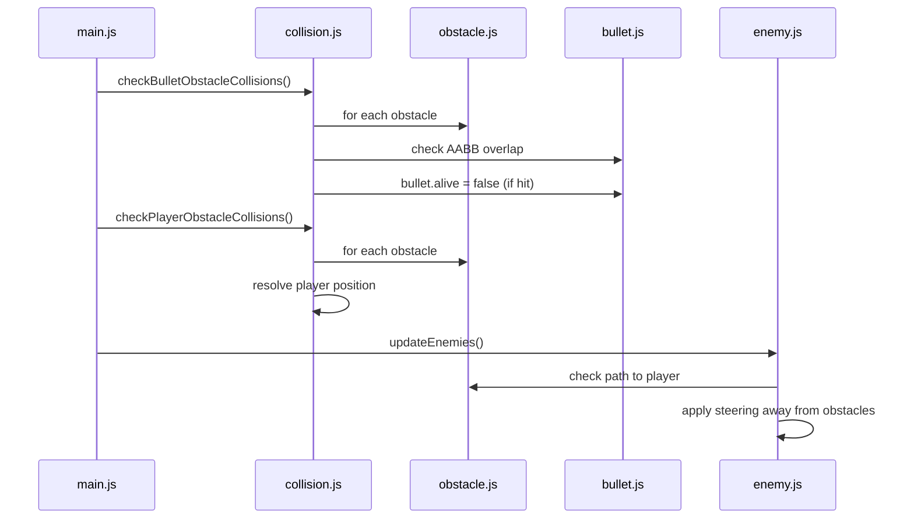

# Design Document: Game Upgrades v1

## Overview

This feature enhances Pixel Survivor with four major improvements: (1) a rotatable pixel-art player sprite that faces the mouse cursor, (2) zombie-themed enemy sprites with shambling animation, (3) a power-up selection system that pauses between waves offering stackable upgrades, and (4) randomly-placed obstacles that block movement and projectiles. These additions increase visual polish, strategic depth, and gameplay variety while maintaining the existing wave-based survival mechanics, WASD movement, Supabase leaderboard, and scoring system.

## Architecture



## Sequence Diagrams

### Wave Clear → Power-Up Selection Flow



### Obstacle Collision Detection Flow



## Components and Interfaces

### Component 1: Player Sprite Rotation

**Purpose**: Render the player as a pixel-art person that rotates to face the mouse cursor

**Interface**:
```javascript
// player.js
export function drawPlayer(ctx, player, mouseX, mouseY)
```

**Responsibilities**:
- Calculate angle from player center to mouse position using Math.atan2()
- Use canvas transformation: save(), translate(), rotate(), restore()
- Draw player sprite centered at origin (0, 0) with body, head, arms, legs
- Maintain invincibility flash effect during damage immunity

**Data Requirements**:
- player.x, player.y (position)
- mouseX, mouseY (cursor position)
- player.invincible, player.invTimer (damage state)


### Component 2: Zombie Enemy Sprites

**Purpose**: Render enemies as pixel-art zombies with shambling animation and color variation

**Interface**:
```javascript
// enemy.js
export function drawEnemies(ctx, enemies)

// Enhanced enemy object structure
{
  x, y, speed, width, height, alive,
  colorTint: number,      // 0-2 for color variation
  shambleOffset: number   // calculated per frame
}
```

**Responsibilities**:
- Assign random colorTint (0-2) to each enemy on spawn
- Calculate shamble offset using Math.sin(Date.now() / 200) for leg wobble
- Draw body (dark green), head (larger greenish), outstretched arms
- Apply color variation: dark green (#2d5016), olive (#4a5d23), grey-green (#3d4a3a)


### Component 3: Power-Up System (NEW MODULE)

**Purpose**: Pause game between waves, present 3 random power-up choices, apply selected upgrade

**Interface**:
```javascript
// powerup.js
export function generatePowerUpOptions(state)
export function drawPowerUpScreen(ctx, options)
export function handlePowerUpSelection(state, selectedIndex)
export function applyPowerUpEffects(state)

// Power-up data structure
{
  id: string,           // 'speed', 'rapidfire', 'tripleshot', etc.
  name: string,         // Display name
  description: string,  // Short description
  apply: function       // Function to modify state
}
```

**Responsibilities**:
- Generate 3 unique random power-ups from available pool
- Render power-up selection screen with cards (name, description)
- Handle mouse click detection on cards
- Apply power-up effects to state (modify player.speed, shootCooldown, etc.)
- Store active power-ups in state.powerUps array
- Enforce stacking limits (speed max 320, cooldown min 80ms, shield max 6 lives)


### Component 4: Obstacle System (NEW MODULE)

**Purpose**: Generate, render, and manage collision detection for obstacles

**Interface**:
```javascript
// obstacle.js
export function generateObstacles(state)
export function drawObstacles(ctx, obstacles)

// Obstacle data structure
{
  x: number,
  y: number,
  width: number,   // 40
  height: number   // 40
}
```

**Responsibilities**:
- Generate obstacles based on wave number (wave 1-2: 3, wave 3-5: 5, wave 6+: 7)
- Place obstacles randomly, avoiding player spawn (320, 240) within 80px radius
- Render obstacles as stacked brick rectangles with alternating grey shades
- Store obstacles in state.obstacles array


### Component 5: Extended Collision Detection

**Purpose**: Add obstacle collision detection for bullets, player, and enemies

**Interface**:
```javascript
// collision.js
export function checkBulletObstacleCollisions(state)
export function checkPlayerObstacleCollisions(state)
export function getObstacleSteering(enemy, obstacles, player)
```

**Responsibilities**:
- Detect AABB overlap between bullets and obstacles (mark bullet.alive = false)
- Detect AABB overlap between player and obstacles (prevent movement)
- Calculate steering vector for enemies to avoid obstacles while pursuing player
- Use simple repulsion force when enemy is within 60px of obstacle


## Data Models

### Enhanced Game State

```javascript
{
  screen: string,  // add 'powerup-selection' to existing values
  wave: number,
  score: number,
  player: {
    x, y, speed, hp, invincible, invTimer, width, height,
    shootCooldown: number,      // NEW: time between shots (default 200ms)
    lastShotTime: number        // NEW: timestamp of last shot
  },
  enemies: [
    {
      x, y, speed, width, height, alive,
      colorTint: number,        // NEW: 0-2 for color variation
    }
  ],
  bullets: [
    {
      x, y, vx, vy, width, height, alive,
      piercing: boolean,        // NEW: passes through enemies
      damage: number            // NEW: for big bullets
    }
  ],
  obstacles: [                  // NEW
    { x, y, width, height }
  ],
  powerUps: [                   // NEW: active power-ups
    { id, name, description }
  ],
  powerUpOptions: [             // NEW: current selection choices
    { id, name, description, apply }
  ],
  keys: Set,
  mouse: { x, y },
  waveTimer: number
}
```


### Power-Up Definitions

```javascript
const POWER_UPS = {
  speed: {
    id: 'speed',
    name: 'Speed Boost',
    description: 'Increases movement speed by 40',
    apply: (state) => {
      state.player.speed = Math.min(320, state.player.speed + 40);
    }
  },
  rapidfire: {
    id: 'rapidfire',
    name: 'Rapid Fire',
    description: 'Reduces shoot cooldown by 30%',
    apply: (state) => {
      state.player.shootCooldown = Math.max(80, state.player.shootCooldown * 0.7);
    }
  },
  tripleshot: {
    id: 'tripleshot',
    name: 'Triple Shot',
    description: 'Fire 3 bullets at once',
    apply: (state) => {
      state.powerUps.push({ id: 'tripleshot' });
    }
  },
  bigbullets: {
    id: 'bigbullets',
    name: 'Big Bullets',
    description: 'Larger bullets with bigger damage radius',
    apply: (state) => {
      state.powerUps.push({ id: 'bigbullets' });
    }
  },
  piercing: {
    id: 'piercing',
    name: 'Piercing Shot',
    description: 'Bullets pass through enemies',
    apply: (state) => {
      state.powerUps.push({ id: 'piercing' });
    }
  },
  shield: {
    id: 'shield',
    name: 'Shield',
    description: 'Grants 1 extra life',
    apply: (state) => {
      state.player.hp = Math.min(6, state.player.hp + 1);
    }
  }
};
```

**Validation Rules**:
- Speed cannot exceed 320 (stackable with diminishing returns)
- Shoot cooldown cannot go below 80ms (stackable with diminishing returns)
- Shield cannot exceed 6 lives (hard cap)
- Triple Shot, Big Bullets, Piercing are boolean flags (not stackable)


## Algorithmic Pseudocode

### Player Rotation Algorithm

```javascript
function drawPlayer(ctx, player, mouseX, mouseY) {
  // INPUT: ctx (canvas context), player (position, size, state), mouseX, mouseY (cursor)
  // OUTPUT: rendered rotatable player sprite
  // PRECONDITION: player.x, player.y are valid canvas coordinates
  // POSTCONDITION: player sprite drawn facing mouse cursor
  
  if (player.invincible && Math.floor(player.invTimer * 10) % 2 === 0) {
    return; // flash effect
  }
  
  const centerX = player.x + player.width / 2;
  const centerY = player.y + player.height / 2;
  
  // Calculate angle from player to mouse
  const dx = mouseX - centerX;
  const dy = mouseY - centerY;
  const angle = Math.atan2(dy, dx);
  
  ctx.save();
  ctx.translate(centerX, centerY);
  ctx.rotate(angle);
  
  // Draw sprite centered at origin
  // Body (12x16 torso)
  ctx.fillStyle = '#14b8a6';
  ctx.fillRect(-6, -8, 12, 16);
  
  // Head (12x6)
  ctx.fillStyle = '#5eead4';
  ctx.fillRect(-6, -8, 12, 6);
  
  // Eyes (2x2 each)
  ctx.fillStyle = '#0f172a';
  ctx.fillRect(-4, -6, 2, 2);
  ctx.fillRect(2, -6, 2, 2);
  
  // Arms (2px wide, 10px long, on sides)
  ctx.fillStyle = '#14b8a6';
  ctx.fillRect(-8, -2, 2, 10);  // left arm
  ctx.fillRect(6, -2, 2, 10);   // right arm
  
  // Legs (2px wide, 8px long)
  ctx.fillRect(-4, 8, 2, 8);    // left leg
  ctx.fillRect(2, 8, 2, 8);     // right leg
  
  ctx.restore();
}
```

**Preconditions**:
- player object has valid x, y, width, height properties
- mouseX, mouseY are within canvas bounds or reasonable values
- ctx is a valid 2D canvas rendering context

**Postconditions**:
- Player sprite rendered at player.x, player.y
- Sprite rotated to face mouse cursor
- Canvas transformation state restored
- Invincibility flash effect applied if player.invincible is true

**Loop Invariants**: N/A (no loops)


### Zombie Sprite Rendering Algorithm

```javascript
function drawEnemies(ctx, enemies) {
  // INPUT: ctx (canvas context), enemies (array of enemy objects)
  // OUTPUT: rendered zombie sprites with shambling animation
  // PRECONDITION: enemies array contains valid enemy objects
  // POSTCONDITION: all alive enemies rendered with color variation and shamble effect
  
  const shambleOffset = Math.sin(Date.now() / 200) * 2;
  
  for (const enemy of enemies) {
    // LOOP INVARIANT: all previously processed enemies have been rendered
    if (!enemy.alive) continue;
    
    const x = Math.floor(enemy.x);
    const y = Math.floor(enemy.y);
    
    // Select color based on enemy.colorTint (0-2)
    const colors = ['#2d5016', '#4a5d23', '#3d4a3a'];
    const bodyColor = colors[enemy.colorTint % 3];
    
    // Body (12x14 torso)
    ctx.fillStyle = bodyColor;
    ctx.fillRect(x + 1, y + 4, 12, 10);
    
    // Head (14x8, larger than body)
    ctx.fillStyle = '#3d5a1f';
    ctx.fillRect(x, y, 14, 8);
    
    // Outstretched arms (16px wide total, 2px thick)
    ctx.fillStyle = bodyColor;
    ctx.fillRect(x - 2, y + 6, 18, 2);
    
    // Legs with shamble effect (2px wide each, offset by shambleOffset)
    ctx.fillRect(x + 3, y + 14 + shambleOffset, 2, 6);
    ctx.fillRect(x + 9, y + 14 - shambleOffset, 2, 6);
  }
}
```

**Preconditions**:
- enemies is a valid array
- Each enemy has x, y, alive, colorTint properties
- colorTint is a number (0-2)

**Postconditions**:
- All alive enemies rendered as zombie sprites
- Shamble animation applied to legs
- Color variation applied based on colorTint

**Loop Invariants**:
- All previously processed enemies in the iteration have been rendered
- Canvas state remains consistent throughout iteration


### Power-Up Selection Algorithm

```javascript
function generatePowerUpOptions(state) {
  // INPUT: state (game state)
  // OUTPUT: 3 unique random power-up options stored in state.powerUpOptions
  // PRECONDITION: POWER_UPS object is defined with at least 3 power-ups
  // POSTCONDITION: state.powerUpOptions contains exactly 3 unique power-ups
  
  const allPowerUps = Object.values(POWER_UPS);
  const selected = [];
  const available = [...allPowerUps];
  
  while (selected.length < 3 && available.length > 0) {
    // LOOP INVARIANT: selected contains unique power-ups, selected.length <= 3
    const randomIndex = Math.floor(Math.random() * available.length);
    selected.push(available[randomIndex]);
    available.splice(randomIndex, 1);
  }
  
  state.powerUpOptions = selected;
}

function handlePowerUpSelection(state, selectedIndex) {
  // INPUT: state (game state), selectedIndex (0-2)
  // OUTPUT: selected power-up applied to state
  // PRECONDITION: selectedIndex is valid (0-2), state.powerUpOptions has 3 items
  // POSTCONDITION: power-up effect applied, screen transitions to 'wave-break'
  
  if (selectedIndex < 0 || selectedIndex >= state.powerUpOptions.length) {
    return; // invalid selection
  }
  
  const selectedPowerUp = state.powerUpOptions[selectedIndex];
  selectedPowerUp.apply(state);
  
  state.screen = 'wave-break';
  state.waveTimer = 3;
  state.powerUpOptions = [];
}
```

**Preconditions**:
- POWER_UPS contains at least 3 power-up definitions
- state.powerUpOptions is initialized as empty array
- selectedIndex is a number between 0-2

**Postconditions**:
- state.powerUpOptions contains exactly 3 unique power-ups
- Selected power-up's apply function modifies state correctly
- Screen transitions to 'wave-break' after selection
- Power-up effects respect stacking limits

**Loop Invariants**:
- selected array contains only unique power-ups
- selected.length <= 3 throughout iteration
- available array shrinks by 1 each iteration


### Obstacle Generation Algorithm

```javascript
function generateObstacles(state) {
  // INPUT: state (game state with wave number)
  // OUTPUT: obstacles array populated based on wave
  // PRECONDITION: state.wave is a positive integer
  // POSTCONDITION: obstacles placed randomly, avoiding player spawn area
  
  const wave = state.wave;
  let obstacleCount;
  
  if (wave <= 2) {
    obstacleCount = 3;
  } else if (wave <= 5) {
    obstacleCount = 5;
  } else {
    obstacleCount = 7;
  }
  
  state.obstacles = [];
  const playerSpawnX = 320;
  const playerSpawnY = 240;
  const safeRadius = 80;
  
  for (let i = 0; i < obstacleCount; i++) {
    // LOOP INVARIANT: all obstacles in state.obstacles are valid and outside safe zone
    let x, y;
    let attempts = 0;
    
    do {
      x = Math.random() * (640 - 40);
      y = Math.random() * (480 - 40);
      
      const dx = x + 20 - playerSpawnX;
      const dy = y + 20 - playerSpawnY;
      const dist = Math.sqrt(dx * dx + dy * dy);
      
      attempts++;
      if (attempts > 100) break; // prevent infinite loop
      
    } while (dist < safeRadius);
    
    state.obstacles.push({ x, y, width: 40, height: 40 });
  }
}
```

**Preconditions**:
- state.wave is a positive integer
- Canvas dimensions are 640x480
- Player spawn point is at (320, 240)

**Postconditions**:
- state.obstacles contains obstacleCount obstacles
- All obstacles are 40x40 pixels
- No obstacle center is within 80px of player spawn point
- Obstacles are within canvas bounds

**Loop Invariants**:
- All obstacles added to state.obstacles are valid (within bounds, outside safe zone)
- i represents the number of obstacles successfully placed
- attempts counter prevents infinite loops in placement


### Obstacle Collision Detection Algorithm

```javascript
function checkBulletObstacleCollisions(state) {
  // INPUT: state (game state with bullets and obstacles)
  // OUTPUT: bullets marked as dead if they hit obstacles
  // PRECONDITION: state.bullets and state.obstacles are valid arrays
  // POSTCONDITION: bullets that collide with obstacles have alive = false
  
  for (const bullet of state.bullets) {
    // LOOP INVARIANT: all previously checked bullets have correct alive status
    if (!bullet.alive) continue;
    
    for (const obstacle of state.obstacles) {
      if (aabbOverlap(bullet, obstacle)) {
        bullet.alive = false;
        break; // bullet can only hit one obstacle
      }
    }
  }
}

function checkPlayerObstacleCollisions(state) {
  // INPUT: state (game state with player and obstacles)
  // OUTPUT: player position adjusted to prevent overlap
  // PRECONDITION: state.player and state.obstacles are valid
  // POSTCONDITION: player does not overlap with any obstacle
  
  const { player, obstacles } = state;
  
  for (const obstacle of obstacles) {
    if (aabbOverlap(player, obstacle)) {
      // Simple resolution: push player back to previous valid position
      // Calculate overlap on each axis
      const overlapX = Math.min(
        player.x + player.width - obstacle.x,
        obstacle.x + obstacle.width - player.x
      );
      const overlapY = Math.min(
        player.y + player.height - obstacle.y,
        obstacle.y + obstacle.height - player.y
      );
      
      // Push back on axis with smallest overlap
      if (overlapX < overlapY) {
        if (player.x < obstacle.x) {
          player.x -= overlapX;
        } else {
          player.x += overlapX;
        }
      } else {
        if (player.y < obstacle.y) {
          player.y -= overlapY;
        } else {
          player.y += overlapY;
        }
      }
    }
  }
}
```

**Preconditions**:
- state.bullets is a valid array of bullet objects
- state.obstacles is a valid array of obstacle objects
- state.player has valid x, y, width, height properties
- aabbOverlap function is defined and correct

**Postconditions**:
- Bullets that hit obstacles are marked alive = false
- Player position adjusted to not overlap obstacles
- Collision resolution uses minimum overlap axis

**Loop Invariants**:
- All previously processed bullets have correct alive status
- Player position remains within canvas bounds after resolution


### Enemy Obstacle Steering Algorithm

```javascript
function updateEnemies(state, dt) {
  // INPUT: state (game state), dt (delta time)
  // OUTPUT: enemy positions updated with obstacle avoidance
  // PRECONDITION: state.enemies and state.obstacles are valid arrays
  // POSTCONDITION: enemies move toward player while avoiding obstacles
  
  const { player, enemies, obstacles } = state;
  const playerCenterX = player.x + player.width / 2;
  const playerCenterY = player.y + player.height / 2;
  
  for (const enemy of enemies) {
    // LOOP INVARIANT: all previously processed enemies have valid positions
    if (!enemy.alive) continue;
    
    const enemyCenterX = enemy.x + enemy.width / 2;
    const enemyCenterY = enemy.y + enemy.height / 2;
    
    // Base direction toward player
    let dx = playerCenterX - enemyCenterX;
    let dy = playerCenterY - enemyCenterY;
    
    // Apply obstacle avoidance steering
    for (const obstacle of obstacles) {
      const obstacleCenterX = obstacle.x + obstacle.width / 2;
      const obstacleCenterY = obstacle.y + obstacle.height / 2;
      
      const obstDx = enemyCenterX - obstacleCenterX;
      const obstDy = enemyCenterY - obstacleCenterY;
      const obstDist = Math.sqrt(obstDx * obstDx + obstDy * obstDy);
      
      // Apply repulsion if within 60px
      if (obstDist < 60 && obstDist > 0) {
        const repulsionStrength = (60 - obstDist) / 60;
        dx += (obstDx / obstDist) * repulsionStrength * 100;
        dy += (obstDy / obstDist) * repulsionStrength * 100;
      }
    }
    
    // Normalize and apply movement
    const dist = Math.sqrt(dx * dx + dy * dy);
    if (dist > 0) {
      enemy.x += (dx / dist) * enemy.speed * dt;
      enemy.y += (dy / dist) * enemy.speed * dt;
    }
  }
}
```

**Preconditions**:
- state.enemies contains valid enemy objects with x, y, speed, alive properties
- state.obstacles contains valid obstacle objects
- dt is a positive number representing delta time in seconds

**Postconditions**:
- Enemies move toward player
- Enemies steer away from obstacles within 60px radius
- Movement is frame-rate independent (uses dt)
- Repulsion strength scales with distance (closer = stronger)

**Loop Invariants**:
- All processed enemies have valid positions within or near canvas bounds
- Direction vector (dx, dy) is normalized before applying speed
- Repulsion forces accumulate for multiple nearby obstacles


### Shooting with Power-Up Effects Algorithm

```javascript
function fireBullet(state) {
  // INPUT: state (game state with player, mouse, power-ups)
  // OUTPUT: bullets created based on active power-ups
  // PRECONDITION: state.player, state.mouse are valid
  // POSTCONDITION: 1 or 3 bullets created depending on tripleshot power-up
  
  const { player, mouse, bullets, powerUps } = state;
  const now = Date.now();
  
  // Check cooldown
  if (now - player.lastShotTime < player.shootCooldown) {
    return;
  }
  
  player.lastShotTime = now;
  
  const centerX = player.x + player.width / 2;
  const centerY = player.y + player.height / 2;
  
  const dx = mouse.x - centerX;
  const dy = mouse.y - centerY;
  const dist = Math.sqrt(dx * dx + dy * dy);
  
  if (dist === 0) return;
  
  const baseAngle = Math.atan2(dy, dx);
  const speed = 400;
  
  // Check for triple shot
  const hasTripleShot = powerUps.some(p => p.id === 'tripleshot');
  const hasBigBullets = powerUps.some(p => p.id === 'bigbullets');
  const hasPiercing = powerUps.some(p => p.id === 'piercing');
  
  const angles = hasTripleShot 
    ? [baseAngle - 0.26, baseAngle, baseAngle + 0.26]  // 15 degrees = 0.26 radians
    : [baseAngle];
  
  for (const angle of angles) {
    const bulletSize = hasBigBullets ? 8 : 4;
    
    bullets.push({
      x: centerX - bulletSize / 2,
      y: centerY - bulletSize / 2,
      vx: Math.cos(angle) * speed,
      vy: Math.sin(angle) * speed,
      width: bulletSize,
      height: bulletSize,
      alive: true,
      piercing: hasPiercing,
      damage: hasBigBullets ? 2 : 1
    });
  }
}
```

**Preconditions**:
- state.player has valid position, shootCooldown, lastShotTime
- state.mouse has valid x, y coordinates
- state.powerUps is a valid array
- Date.now() returns current timestamp

**Postconditions**:
- 1 bullet created if no triple shot, 3 bullets if triple shot active
- Bullets have size 4x4 (normal) or 8x8 (big bullets)
- Bullets have piercing flag set if piercing power-up active
- Cooldown timer updated to prevent rapid firing
- Bullets spread at 15-degree intervals for triple shot

**Loop Invariants**:
- All bullets created have valid velocity vectors
- Bullet count matches angles array length


## Key Functions with Formal Specifications

### Function 1: drawPlayer()

```javascript
function drawPlayer(ctx, player, mouseX, mouseY)
```

**Preconditions:**
- ctx is a valid CanvasRenderingContext2D
- player object has properties: x, y, width, height, invincible, invTimer
- mouseX, mouseY are numbers (can be any value, including outside canvas)
- player.x, player.y are within canvas bounds or reasonable range

**Postconditions:**
- Player sprite rendered at (player.x, player.y) rotated toward (mouseX, mouseY)
- Canvas transformation matrix restored to original state
- If player.invincible is true and flash condition met, no rendering occurs
- Sprite consists of body, head, eyes, arms, legs drawn relative to center

**Loop Invariants:** N/A (no loops)

---

### Function 2: generatePowerUpOptions()

```javascript
function generatePowerUpOptions(state)
```

**Preconditions:**
- state is a valid game state object
- POWER_UPS object contains at least 3 power-up definitions
- state.powerUpOptions is defined (can be empty or populated)

**Postconditions:**
- state.powerUpOptions contains exactly 3 unique power-up objects
- Each power-up has id, name, description, apply properties
- No duplicate power-ups in the selection
- Original POWER_UPS object unchanged

**Loop Invariants:**
- selected array contains only unique power-ups
- selected.length <= 3 throughout execution
- available array shrinks by 1 each iteration

---

### Function 3: checkBulletObstacleCollisions()

```javascript
function checkBulletObstacleCollisions(state)
```

**Preconditions:**
- state.bullets is a valid array (can be empty)
- state.obstacles is a valid array (can be empty)
- Each bullet has x, y, width, height, alive properties
- Each obstacle has x, y, width, height properties
- aabbOverlap function is defined and correct

**Postconditions:**
- Bullets that overlap with obstacles have alive = false
- Bullets that don't overlap remain unchanged
- Obstacles are never modified
- Each bullet can only collide with one obstacle per call

**Loop Invariants:**
- All previously checked bullets have correct alive status
- No obstacle properties are modified during iteration


### Function 4: generateObstacles()

```javascript
function generateObstacles(state)
```

**Preconditions:**
- state.wave is a positive integer >= 1
- Canvas dimensions are 640x480 pixels
- Player spawn point is at (320, 240)
- state.obstacles is defined (will be overwritten)

**Postconditions:**
- state.obstacles contains 3 obstacles (wave 1-2), 5 (wave 3-5), or 7 (wave 6+)
- All obstacles are 40x40 pixels
- No obstacle center is within 80px of (320, 240)
- All obstacles are within canvas bounds (0 <= x <= 600, 0 <= y <= 440)
- Placement algorithm attempts up to 100 tries per obstacle

**Loop Invariants:**
- All obstacles in state.obstacles are valid and outside safe zone
- i represents number of obstacles successfully placed
- attempts counter prevents infinite loops

---

### Function 5: fireBullet()

```javascript
function fireBullet(state)
```

**Preconditions:**
- state.player has x, y, width, height, shootCooldown, lastShotTime properties
- state.mouse has x, y properties
- state.bullets is a valid array
- state.powerUps is a valid array
- Date.now() returns current timestamp in milliseconds

**Postconditions:**
- If cooldown not elapsed, no bullets created
- If cooldown elapsed, 1 bullet created (normal) or 3 bullets (triple shot)
- Each bullet has x, y, vx, vy, width, height, alive, piercing, damage properties
- Bullet size is 4x4 (normal) or 8x8 (big bullets power-up)
- Triple shot bullets spread at ±15 degrees from aim direction
- player.lastShotTime updated to current timestamp

**Loop Invariants:**
- All bullets created have normalized velocity vectors
- Bullet count equals angles array length (1 or 3)


## Example Usage

### Example 1: Player Rotation

```javascript
// In main.js game loop
if (state.screen === 'playing') {
  // ... update logic ...
  
  // Draw player facing mouse cursor
  drawPlayer(ctx, state.player, state.mouse.x, state.mouse.y);
  
  // ... other rendering ...
}
```

### Example 2: Power-Up Selection Flow

```javascript
// In wave.js - when wave clears
export function checkWaveClear(state) {
  if (state.screen !== 'playing') return;
  
  if (state.enemies.length === 0) {
    state.screen = 'powerup-selection';
    generatePowerUpOptions(state);
  }
}

// In main.js - handle power-up click
canvas.addEventListener('click', (e) => {
  if (state.screen === 'powerup-selection') {
    const rect = canvas.getBoundingClientRect();
    const x = e.clientX - rect.left;
    const y = e.clientY - rect.top;
    
    // Check which card was clicked (3 cards at y=200, spaced 200px apart)
    if (y >= 180 && y <= 320) {
      if (x >= 20 && x < 200) {
        handlePowerUpSelection(state, 0);
      } else if (x >= 220 && x < 400) {
        handlePowerUpSelection(state, 1);
      } else if (x >= 420 && x < 600) {
        handlePowerUpSelection(state, 2);
      }
    }
  }
});
```

### Example 3: Obstacle Generation on Wave Start

```javascript
// In main.js - when wave break ends
if (state.screen === 'playing' && state.waveTimer <= 0) {
  generateObstacles(state);
  spawnWave(state);
}
```

### Example 4: Shooting with Triple Shot

```javascript
// In main.js - click handler
canvas.addEventListener('click', () => {
  if (state.screen === 'playing') {
    fireBullet(state);
    // If player has triple shot, 3 bullets are created
    // Otherwise, 1 bullet is created
  }
});
```

### Example 5: Enemy Obstacle Avoidance

```javascript
// In enemy.js - update function
export function updateEnemies(state, dt) {
  const { player, enemies, obstacles } = state;
  
  for (const enemy of enemies) {
    if (!enemy.alive) continue;
    
    // Calculate direction with obstacle steering
    let dx = player.x - enemy.x;
    let dy = player.y - enemy.y;
    
    // Apply repulsion from nearby obstacles
    for (const obstacle of obstacles) {
      const obstDist = distance(enemy, obstacle);
      if (obstDist < 60) {
        const repulsion = calculateRepulsion(enemy, obstacle, obstDist);
        dx += repulsion.x;
        dy += repulsion.y;
      }
    }
    
    // Normalize and move
    const dist = Math.sqrt(dx * dx + dy * dy);
    if (dist > 0) {
      enemy.x += (dx / dist) * enemy.speed * dt;
      enemy.y += (dy / dist) * enemy.speed * dt;
    }
  }
}
```


## Correctness Properties

### Property 1: Player Rotation Correctness
**Universal Quantification**: ∀ player, mouse positions → player sprite angle = atan2(mouse.y - player.y, mouse.x - player.x)

**Verification**: The player sprite's rotation angle must always point toward the mouse cursor, calculated using Math.atan2() for correct quadrant handling.

---

### Property 2: Power-Up Uniqueness
**Universal Quantification**: ∀ power-up selections → |powerUpOptions| = 3 ∧ all elements unique

**Verification**: The power-up selection screen must always present exactly 3 unique power-ups with no duplicates.

---

### Property 3: Power-Up Stacking Limits
**Universal Quantification**: ∀ power-up applications → (speed <= 320) ∧ (shootCooldown >= 80) ∧ (hp <= 6)

**Verification**: Speed Boost cannot exceed 320, Rapid Fire cannot reduce cooldown below 80ms, Shield cannot exceed 6 lives.

---

### Property 4: Obstacle Safe Zone
**Universal Quantification**: ∀ obstacles → distance(obstacle.center, (320, 240)) >= 80

**Verification**: No obstacle center can be placed within 80 pixels of the player spawn point at (320, 240).

---

### Property 5: Obstacle Count by Wave
**Universal Quantification**: 
- ∀ wave ∈ [1,2] → obstacleCount = 3
- ∀ wave ∈ [3,5] → obstacleCount = 5
- ∀ wave >= 6 → obstacleCount = 7

**Verification**: Obstacle count must match the wave-based formula.

---

### Property 6: Bullet-Obstacle Collision
**Universal Quantification**: ∀ bullets, obstacles → (aabbOverlap(bullet, obstacle) ⟹ bullet.alive = false)

**Verification**: Any bullet that overlaps with an obstacle must be marked as dead (unless piercing power-up is active).

---

### Property 7: Triple Shot Angle Spread
**Universal Quantification**: ∀ triple shot bullets → angles = [baseAngle - 0.26, baseAngle, baseAngle + 0.26]

**Verification**: Triple shot must fire 3 bullets at exactly 15-degree intervals (0.26 radians).

---

### Property 8: Zombie Color Variation
**Universal Quantification**: ∀ enemies → colorTint ∈ [0, 1, 2]

**Verification**: Each zombie must have a colorTint value of 0, 1, or 2 for color variation.

---

### Property 9: Shamble Animation Continuity
**Universal Quantification**: ∀ frames → shambleOffset = sin(Date.now() / 200) * 2

**Verification**: Zombie leg shamble animation must be continuous and synchronized across all zombies.

---

### Property 10: Screen Transition on Power-Up Selection
**Universal Quantification**: ∀ power-up selections → (screen = 'powerup-selection') ⟹ (after selection → screen = 'wave-break')

**Verification**: Selecting a power-up must transition the screen from 'powerup-selection' to 'wave-break'.


## Error Handling

### Error Scenario 1: Invalid Power-Up Selection Index

**Condition**: User clicks outside valid power-up card boundaries or selectedIndex is out of range

**Response**: handlePowerUpSelection() returns early without applying any power-up

**Recovery**: User can click again on a valid card; game state remains unchanged

---

### Error Scenario 2: Obstacle Placement Failure

**Condition**: Cannot find valid placement after 100 attempts (rare edge case with many obstacles)

**Response**: Place obstacle at last attempted position even if within safe zone

**Recovery**: Game continues; obstacle may be closer to spawn than ideal but still playable

---

### Error Scenario 3: Zero Distance in Normalization

**Condition**: Mouse cursor exactly at player center (dx = 0, dy = 0) when firing

**Response**: fireBullet() returns early without creating bullets

**Recovery**: User moves mouse slightly; next click will fire normally

---

### Error Scenario 4: Piercing Bullet Collision

**Condition**: Bullet with piercing power-up hits enemy

**Response**: Enemy is killed but bullet.alive remains true, continues traveling

**Recovery**: Bullet continues until hitting obstacle or leaving canvas bounds

---

### Error Scenario 5: Power-Up Applied Beyond Limit

**Condition**: Speed Boost applied when speed is already 320, or Shield when hp is 6

**Response**: Math.min() / Math.max() clamps value to limit; no error thrown

**Recovery**: Power-up is consumed but has no effect; player can select different power-up next wave

---

### Error Scenario 6: Enemy Stuck on Obstacle

**Condition**: Enemy pathfinding leads to getting stuck against obstacle

**Response**: Repulsion force pushes enemy away from obstacle while still pursuing player

**Recovery**: Enemy gradually steers around obstacle using accumulated repulsion vectors

---

### Error Scenario 7: Rapid Click During Cooldown

**Condition**: Player clicks rapidly while shootCooldown has not elapsed

**Response**: fireBullet() checks Date.now() - lastShotTime and returns early if cooldown active

**Recovery**: Bullets fire only when cooldown expires; no extra bullets created


## Testing Strategy

### Unit Testing Approach

**Player Rotation**:
- Test angle calculation for all 4 quadrants (mouse in each corner)
- Test edge case: mouse at player center (should handle gracefully)
- Test canvas transformation state restoration after drawing
- Test invincibility flash effect (render vs skip based on timer)

**Zombie Sprites**:
- Test colorTint assignment (0-2 range)
- Test shamble offset calculation (continuous sine wave)
- Test rendering with different colorTint values
- Test alive/dead filtering

**Power-Up System**:
- Test generatePowerUpOptions() produces 3 unique power-ups
- Test each power-up's apply() function modifies state correctly
- Test stacking limits (speed max 320, cooldown min 80ms, hp max 6)
- Test power-up selection index validation (0-2 range)
- Test screen transition from 'powerup-selection' to 'wave-break'

**Obstacle Generation**:
- Test obstacle count by wave (3, 5, 7)
- Test safe zone enforcement (no obstacles within 80px of spawn)
- Test obstacle bounds (all within canvas)
- Test placement algorithm with edge cases (wave 1, wave 10)

**Collision Detection**:
- Test bullet-obstacle AABB overlap detection
- Test player-obstacle collision resolution
- Test enemy obstacle avoidance steering
- Test piercing bullets ignore enemy collision but not obstacles

### Property-Based Testing Approach

**Property Test Library**: fast-check (JavaScript property-based testing)

**Property 1: Player Rotation Angle**
```javascript
fc.assert(
  fc.property(
    fc.record({
      playerX: fc.integer(0, 640),
      playerY: fc.integer(0, 480),
      mouseX: fc.integer(0, 640),
      mouseY: fc.integer(0, 480)
    }),
    ({ playerX, playerY, mouseX, mouseY }) => {
      const expectedAngle = Math.atan2(mouseY - playerY, mouseX - playerX);
      const actualAngle = calculatePlayerAngle(playerX, playerY, mouseX, mouseY);
      return Math.abs(expectedAngle - actualAngle) < 0.001;
    }
  )
);
```

**Property 2: Power-Up Uniqueness**
```javascript
fc.assert(
  fc.property(
    fc.constant(null),
    () => {
      const state = createGameState();
      generatePowerUpOptions(state);
      const ids = state.powerUpOptions.map(p => p.id);
      return ids.length === 3 && new Set(ids).size === 3;
    }
  )
);
```

**Property 3: Obstacle Safe Zone**
```javascript
fc.assert(
  fc.property(
    fc.integer(1, 20),
    (wave) => {
      const state = { wave, obstacles: [] };
      generateObstacles(state);
      return state.obstacles.every(obs => {
        const dx = (obs.x + 20) - 320;
        const dy = (obs.y + 20) - 240;
        const dist = Math.sqrt(dx * dx + dy * dy);
        return dist >= 80 || state.obstacles.length < 3; // allow failure case
      });
    }
  )
);
```

**Property 4: Stacking Limits**
```javascript
fc.assert(
  fc.property(
    fc.array(fc.constantFrom('speed', 'rapidfire', 'shield'), { minLength: 1, maxLength: 20 }),
    (powerUpSequence) => {
      const state = createGameState();
      for (const id of powerUpSequence) {
        POWER_UPS[id].apply(state);
      }
      return state.player.speed <= 320 && 
             state.player.shootCooldown >= 80 && 
             state.player.hp <= 6;
    }
  )
);
```

### Integration Testing Approach

**Full Wave Cycle Test**:
1. Start game, clear wave 1
2. Verify power-up selection screen appears
3. Select a power-up
4. Verify wave break screen appears
5. Verify wave 2 starts with obstacles
6. Verify power-up effect is active

**Obstacle Interaction Test**:
1. Generate obstacles
2. Fire bullets at obstacles
3. Verify bullets despawn on collision
4. Move player into obstacle
5. Verify player cannot pass through
6. Spawn enemies near obstacles
7. Verify enemies steer around obstacles

**Power-Up Stacking Test**:
1. Apply Speed Boost 10 times
2. Verify speed caps at 320
3. Apply Rapid Fire 10 times
4. Verify cooldown caps at 80ms
5. Apply Shield 10 times
6. Verify hp caps at 6


## Performance Considerations

**Canvas Transformation Overhead**:
- Player rotation uses ctx.save()/restore() every frame
- Minimal performance impact for single player sprite
- Consider caching rotation calculations if performance issues arise

**Obstacle Collision Detection**:
- O(n*m) complexity: n bullets/enemies × m obstacles
- With max 7 obstacles and typical bullet/enemy counts, this is acceptable
- Early exit optimization: break after first collision for bullets

**Enemy Steering Calculations**:
- Each enemy checks distance to all obstacles every frame
- O(enemies × obstacles) = O(n × 7) worst case
- Repulsion calculation uses sqrt() which is relatively expensive
- Optimization: use squared distance for comparison, only sqrt when needed

**Shamble Animation**:
- Date.now() called once per frame, shared across all zombies
- Sin calculation is fast and shared
- No per-enemy animation state needed

**Power-Up Selection**:
- Array shuffling for random selection is O(n) where n = 6 power-ups
- Happens only once per wave, not performance-critical

**Rendering Optimizations**:
- All sprites use fillRect() (fast primitive)
- No image loading or texture sampling
- Pixel-perfect rendering with integer coordinates (Math.floor)

**Expected Performance**:
- Target: 60 FPS on modern browsers
- Bottleneck: Collision detection with many entities
- Acceptable: 30+ FPS with 50+ enemies and 7 obstacles


## Security Considerations

**Client-Side Game State**:
- All game logic runs client-side in browser
- No server-side validation of power-ups or scores
- Potential for client-side manipulation (acceptable for casual game)

**Leaderboard Integrity**:
- Existing Supabase integration remains unchanged
- Power-up system could enable higher scores
- Consider adding score validation or anti-cheat measures if leaderboard abuse occurs

**Input Validation**:
- Power-up selection index validated (0-2 range check)
- Obstacle placement bounded to canvas dimensions
- Mouse coordinates clamped to canvas bounds in existing code

**No New Security Risks**:
- Feature adds no network requests or external dependencies
- No user input beyond existing mouse/keyboard
- No localStorage or cookie usage beyond existing implementation

**Recommendations**:
- Monitor leaderboard for anomalous scores after power-up system launch
- Consider adding score multiplier cap or diminishing returns
- Existing RLS (Row Level Security) on Supabase remains sufficient


## Dependencies

### Existing Dependencies (No Changes)
- **@supabase/supabase-js** (v2.100.1) - Leaderboard backend
- **Vite** (v8.0.1) - Build system and dev server

### New Dependencies
- **None** - All features implemented with vanilla JavaScript and Canvas API

### Browser APIs Used
- **Canvas 2D Context** - All rendering (fillRect, save, restore, translate, rotate)
- **Math API** - atan2, sin, cos, sqrt, floor, random, min, max
- **Date API** - Date.now() for shamble animation timing
- **Event Listeners** - Existing mouse/keyboard handlers extended

### Internal Module Dependencies

**New Modules**:
- `src/powerup.js` - Power-up system (new file)
- `src/obstacle.js` - Obstacle generation and rendering (new file)

**Modified Modules**:
- `src/player.js` - Updated drawPlayer() for rotation
- `src/enemy.js` - Updated drawEnemies() for zombie sprites, updated updateEnemies() for steering
- `src/collision.js` - Added obstacle collision functions
- `src/wave.js` - Modified checkWaveClear() to trigger power-up screen
- `src/state.js` - Extended game state with new properties
- `src/main.js` - Integrated new screens and collision checks
- `src/screens.js` - Added drawPowerUpScreen() function

**Dependency Graph**:
```
main.js
├── state.js (extended)
├── player.js (modified)
├── enemy.js (modified)
├── bullet.js (unchanged)
├── collision.js (extended)
├── wave.js (modified)
├── hud.js (unchanged)
├── screens.js (extended)
├── powerup.js (NEW)
└── obstacle.js (NEW)
```

### Build Configuration
- No changes to `vite.config.js` required
- No changes to `package.json` required
- No new environment variables needed
